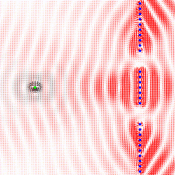

# OpenWME

OpenWME is the first implementation of a **general-purpose** electromagnetic field solver (EM Solver), i.e., software for simulation of the physics of electromagnetic fields, based on Weber-Maxwell electrodynamics. By using the new Weber-Maxwell electrodynamics, OpenWME is not only orders of magnitude faster than any other EM solver that presently exists, but at the same time provides more accurate results with fewer numerical errors. The aforementioned advantages result from the fact that in Weber-Maxwell electrodynamics it is not necessary to solve Maxwell's equations numerically. Complicated electromagnetic fields, waves and their reflections can therefore usually be calculated in a few seconds, while conventional solvers need many hours or even days for similar tasks.



------

## Weber-Maxwell electrodynamics

Key element of Weber-Maxwell electrodynamics is a force formula which describes the electromagnetic force between two point charges and which satisfies Newton's third law, i.e. *actio* = *reactio*. Unlike the well-known Coulomb force, however, the Weber-Maxwell force is universal and can be also applied to moving and arbitrarily accelerated point charges. Thus, compared to the Coulomb force, it contains all electromagnetic effects, e.g. magnetism or induction. 

However, Weber-Maxwell electrodynamics is also excellently suited for the modeling and analysis of electromagnetic waves. In this respect it goes beyond the limits of Weber electrodynamics, which is included as a subset. The relation to Maxwell electrodynamics is that the Weber-Maxwell force is the general solution of Maxwell's equations for point charges, provided that one interprets Maxwell's equations in an adequate way. 

The theoretical foundations are described [here](https://www.quantino-theory.org). OpenWME is currently in the alpha stage.

## Usage

OpenWME consists of a C++ library and a number of example applications that include the library at source code level. The examples are intentionally kept simple.

For most examples, there is also a video that demonstrates the result of the simulation.

### Quasistatics and Weber electrodynamics:
- Magnetism: [Force between two long straight wires](examples/01_quasistatics/01_magnetic_force_between_wires/magnetic_force_between_wires.webm?raw=true)
- Electromagnetic induction: [Generation of a field near a moving conductor loop with direct current](examples/01_quasistatics/02_moving_current_loop_dc_current/moving_current_loop_dc_current.webm?raw=true)
- Lorentz force: [Moving point charge in the field of a Helmholtz coil](examples/01_quasistatics/03_point_particle_in_a_helmholtz_coil/point_particle_in_a_helmholtz_coil.webm?raw=true)

### Electromagnetic waves:
- Electromagnetic induction: [Generation of a field in the vicinity of a stationary conductor loop with alternating current](examples/01_quasistatics/04_current_loop_with_ac_current/current_loop_with_ac_current.webm?raw=true)
- Electromagnetic waves: [Field of a very fast moving electromagnetic transmitter](examples/02_electromagnetic_waves/01_moving_hertzian_dipole/moving_hertzian_dipole.webm?raw=true)
- Reflection of electromagnetic waves: [Electromagnetic pulse reflected back and forth between two Hertzian dipoles](examples/02_electromagnetic_waves/02_reflection_two_resting_hertzian_dipols/reflection_two_resting_hertzian_dipols.webm?raw=true)
- Interference: [Interference of an electromagnetic wave at a double slit](examples/02_electromagnetic_waves/03_interference_at_a_double_slit/interference_at_a_double_slit.webm?raw=true)
- Fields of accelerated point charges: [Field of a point charge moving on a trajectory that corresponds to a lying eight](examples/02_electromagnetic_waves/04_point_charge_on_a_non_trival_path/point_charge_on_a_non_trival_path.webm?raw=true)
- Reflection and polarization: [Hertzian dipole in front of a mirror](examples/02_electromagnetic_waves/05_hertzian_dipole_in_front_of_a_mirror/hertzian_dipole_in_front_of_a_mirror.webm?raw=true)
- Reflection at a double slit: [Interference pattern depends on the relative position of the transmitter](examples/02_electromagnetic_waves/06_interference_depending_on_the_position_relative_to_the_openings/interference_depending_on_the_position_relative_to_the_openings.webm?raw=true)
- Electromagnetic shielding: [Shielding by destructive interference](examples/02_electromagnetic_waves/07_shielding/shielding.webm?raw=true)
- Diffraction: [Diffraction on a half-plane](examples/02_electromagnetic_waves/08_diffraction_half_plane/diffraction_half_plane.webm?raw=true)
- Diffraction: [Diffraction at two shifted half planes](examples/02_electromagnetic_waves/09_diffraction_at_shifted_half_planes/diffraction_at_shifted_half_planes.webm?raw=true)
- Shielding and scattering: [Hollow sphere within a field of a transverse_wave](examples/02_electromagnetic_waves/10_hollow_sphere_within_a_field_of_a_transverse_wave/hollow_sphere_within_a_field_of_a_transverse_wave.webm?raw=true)
- Waveguides: [Transmission of a wave in a pipe](examples/02_electromagnetic_waves/11_waveguide/waveguide.webm?raw=true)
- Why do accelerating point charges radiate electromagnetic waves: [Field of a point charge that is suddenly accelerated](examples/02_electromagnetic_waves/12_suddenly_accelerated_point_charge/suddenly_accelerated_point_charge.webm?raw=true)
- Interference: [Another example for interference at a double slit](examples/02_electromagnetic_waves/13_interference_at_a_double_slit/interference_at_a_double_slit.webm?raw=true)

### Research issues outside of classical electrodynamics:
- Special relativity: [Einstein's light clock](examples/03_special_relativity/01_light_clock/light_clock.webm?raw=true)
- Relativity of simultaneity: [Each intertial frame has its own fields](examples/03_special_relativity/02_reflection_moving_transmitter_resting_receiver/reflection_moving_transmitter_resting_receiver.webm?raw=true)
- Quantum forces: [Field of the force of a Hertzian dipole on itself when it is in front of a double slit as a function of the location](examples/04_quantum_mechanics/01_quantum_forces_at_a_double_slit/quantum_forces_at_a_double_slit.png?raw=true)

For the visualization of the results, [Cairo](https://www.cairographics.org/) is currently used. However, the library can also be used without graphical elements.

## Building from source

The development is done on Linux [Ubuntu](https://ubuntu.com/) or [Debian](https://packages.debian.org/), using [GNU Make](https://www.gnu.org/software/make/) to compile the applications. To build OpenWME, the packages `build-essential` and `libcairo2-dev` are needed.

## Licensing

OpenWME is a free, open source software. The source code is available under the GPL v3 license.

------

## Explanations regarding the examples

### 01_quasistatics/01_magnetic_force_between_wires

[main.cpp](examples/01_quasistatics/01_magnetic_force_between_wires/main.cpp) 

[video](examples/01_quasistatics/01_magnetic_force_between_wires/magnetic_force_between_wires.webm?raw=true)

The Weber-Maxwell force is a rather simple formula which only returns the direction and strength of the electromagnetic force between two point charges. The definition of an electric and a magnetic field is bypassed in Weber-Maxwell electrodynamics.

However, this does not mean that there are no magnetic forces in Weber-Maxwell electrodynamics. This example demonstrates this by means of two wires through which a direct current flows. As can be seen, the wires attract each other when the current flows in both wires in the same direction. When the currents flow in opposite directions, the wires repel each other. In standard electrodynamics, one calculates this force by means of the Biot-Savart law and the Lorentz force. In Weber-Maxwell electrodynamics, however, one calculates and sums up the Weber-Maxwell force between each segment of a wire with each other segment of the other wire. The results are identical in practice.

For conductor loops with complicated shapes, the application of the Weber-Maxwell force is advantageous. Furthermore, the Weber-Maxwell force can also be applied to current elements of the same wire. This is not possible with the Biot-Savart law.

The example illustrates the correct usage of a DC current element. It consists of two point charges of opposite charge, which are always at exactly the same place, but do not completely neutralize each other, because they have different velocities. It should be noted that a DC current element is only a model concept, which is only applicable when direct current flows in closed current loops. The example also shows how current can be switched on and off and how mechanical, non-electrical forces can be included in a simulation.

### 01_quasistatics/02_moving_current_loop_dc_current

[main.cpp](examples/01_quasistatics/02_moving_current_loop_dc_current/main.cpp) 

[video](examples/01_quasistatics/02_moving_current_loop_dc_current/moving_current_loop_dc_current.webm?raw=true)

This example illustrates electromagnetic induction. For this purpose, the field of a conductor loop with direct current is calculated, which is being moved with respect to a resting field of probes. A probe is here a special point charge, which can only receive forces, but is not able to emit ones. It is clear that such objects do not exist in reality, because every real measurement modifies the investigated field.

A probe plays an important role in OpenWME, because it is intended to obtain an overview of the dependence of a force on location and time. If one wants to represent a field, one needs to create a grid of probes in the simulation. These probes then measure the force at the locations where they are located. Plotting of the forces of all probes at the locations of the probes produces something which is called a field in standard electrodynamics. In the context of Weber-Maxwell electrodynamics, however, one should be aware that the electromangetic force always acts only between exactly two point charges. In other words, it is a field-less electrodynamics.

Incidentally, in Weber-Maxwell electrodynamics the principle of relativity applies in a particularly strict form. This becomes clear in this example, because one could also let the conductor loop be at rest and move the probes instead. The force on the probes would then be identical.

### 01_quasistatics/03_point_particle_in_a_helmholtz_coil

[main.cpp](examples/01_quasistatics/03_point_particle_in_a_helmholtz_coil/main.cpp) 

[video](examples/01_quasistatics/03_point_particle_in_a_helmholtz_coil/point_particle_in_a_helmholtz_coil.webm?raw=true)

This example illustrates the Lorentz force by calculating how a single negatively charged point charge (electron) moves inside of a Helmholtz coil. The charge, the mass, the initial velocity and the location of the point charge can be easily varied in the source code (lines 56 and 57), which then leads to completely different, partially quite interesting trajectories.

As already mentioned, the Weber-Maxwell force is a rather simple formula which does not need E- and B-fields. The example illustrates that nevertheless all magnetic effects are included correctly and that one is not constrained to define and to use B-fields.

### 01_quasistatics/04_current_loop_with_ac_current

[main.cpp](examples/01_quasistatics/04_current_loop_with_ac_current/main.cpp) 

[video](examples/01_quasistatics/04_current_loop_with_ac_current/current_loop_with_ac_current.webm?raw=true)

Electromagnetic induction occurs not only when DC current loops are moving, but also when the current strength and current direction changes in a stationary conductor loop. This is illustrated in this example. The drawing area corresponds to one square meter. Due to the high frequency of 500 MHz, the wavelength is so short that the individual wave trains can be recognized. If one reduces the frequency, one can only recognize how the direction of the generated field cyclically inverts. Incidentally, one can see that there is a phase shift between the change in current direction and generated field. When the polarity of the current is reversed, the current has to work against the field that it has previously generated itself. This is like a kind of inertia. One calls this effect self-inductance.

### 01_quasistatics/05_definition_unit_ampere

[main.cpp](examples/01_quasistatics/05_definition_unit_ampere/main.cpp) 

In this example, the force between two long straight wires at a distance of one meter is calculated when a direct current of 1 A flows in each of the two wires. The force should be exactly 2e-7 N per meter of wire length according to an older definition of the ampere. The program shows that this is indeed the case.

### 02_electromagnetic_waves/01_moving_hertzian_dipole

[main.cpp](examples/02_electromagnetic_waves/01_moving_hertzian_dipole/main.cpp)

[video](examples/02_electromagnetic_waves/01_moving_hertzian_dipole/moving_hertzian_dipole.webm?raw=true)

The example shows the field of a Hertzian dipole which moves relative to a resting array of probes at a very high speed (70% of the speed of light). Due to the high speed, a pronounced Doppler effect can be observed. In front of the Hertzian dipole the wavelength is shortened. Since the wave for the resting probes moves exactly with the speed of light, this corresponds at the same time to a frequency increase, i.e. a blue shift. Behind the dipole one can see the red shift.

It is very interesting to analyze how the field changes if the probes are also allowed to move at 70% of the speed of light. For this one must only replace the velocity 
```
TVector(0, 0, 0)
```
in line 56 by the velocity 
```
TVector(0.7 * c, 0, 0)
```
This ensures that all probes move along with the Hertzian dipole. The result can be seen in this [video](examples/02_electromagnetic_waves/01_moving_hertzian_dipole/moving_hertzian_dipole_2.webm?raw=true). 

As can be noticed, co-moving probes perceive the field in a completely different way. In particular, the Doppler effect is now absent and the field corresponds to that of an ordinary resting Hertzian dipole. Furthermore it is noticeable that also co-moving probes always have the impression that the wave is moving with the speed of light. This can be recognized by the fact that also here the wave trains are circular.

Note furthermore that Weber-Maxwell electrodynamics does not employ a Lorentz transformation. Furthermore it is pointed out that such relativistic effects are of no interest in electrical engineering, because the difference velocities occurring in electrical engineering are in general extremely small.

### 02_electromagnetic_waves/02_reflection_two_resting_hertzian_dipols

[main.cpp](examples/02_electromagnetic_waves/02_reflection_two_resting_hertzian_dipols/main.cpp)

[video](examples/02_electromagnetic_waves/02_reflection_two_resting_hertzian_dipols/reflection_two_resting_hertzian_dipols.webm?raw=true)

With the help of the Weber-Maxwell force, the reflection of an electromagnetic wave at a Hertzian dipole can be represented in a comparably simple way. There are several ways to achieve this.

The direct method consists in modeling the reflecting Hertzian dipole directly with two point charges and a harmonic force. The advantage of the direct method is that it is very close to reality, since an atom consists of an electron shell and an atomic nucleus. Both can move slightly with respect to each other, and a harmonic force may be assumed for small displacements. The disadvantage of the method is that one needs to solve the equation of motion. This can be performed only approximately and with the time numerical errors arise, which falsify the total energy.

In this simulation, therefore, a heuristic is applied which requires almost no additional computational resources and is inherently stable. Its disadvantage is that it is somewhat less realistic and can cause phase errors. With OpenWME both methods can be realized.

### 02_electromagnetic_waves/03_interference_at_a_double_slit

[main.cpp](examples/02_electromagnetic_waves/03_interference_at_a_double_slit/main.cpp)

[video](examples/02_electromagnetic_waves/03_interference_at_a_double_slit/interference_at_a_double_slit.webm?raw=true)

This example is an extension of the previous example. It shows an arrangement of several reflecting Hertzian dipoles to a double slit. The primary wave is shown in black. The reflected wave, on the other hand, is displayed in red and amplified 10 times. Since the double slit consists of only a single layer of atoms, it may seem that the wave becomes stronger at the locations of the reflecting atoms. However, this is not always true, because secondary wave and primary wave superimpose and cancel each other partially behind the double slit. A similar effect happens in front of the double slit. If there were more than one atomic layer, there would be further reflections. Furthermore, the atoms of the double slit interact also with each other. This effect has been neglected in this simulation.

### 02_electromagnetic_waves/04_point_charge_on_a_non_trival_path

[main.cpp](examples/02_electromagnetic_waves/04_point_charge_on_a_non_trival_path/main.cpp)

[video](examples/02_electromagnetic_waves/04_point_charge_on_a_non_trival_path/point_charge_on_a_non_trival_path.webm?raw=true)

This example illustrates that also accelerated point charges and not only Hertzian dipoles can emit electromagnetic waves. Specifically, an electron is shown moving on a trajectory that resembles a lying number eight. This choice was arbitrary and is used to demonstrate that the shape of the trajectories in OpenWMB can be chosen freely and only have to be physically reasonable. In lines 40, 46 and 52 the trajectory can be defined. It is also interesting, for example, to define the field of a point charge which is suddenly strongly slowed down. Likewise interesting is to reduce the parameter ``freq``. One can see then how the wavelength increases and the wave finally disappears, because the wave trains become so long that they no longer fit into the drawing plane. The field then appears like a normal Coulomb field.

### 02_electromagnetic_waves/05_hertzian_dipole_in_front_of_a_mirror

[main.cpp](examples/02_electromagnetic_waves/05_hertzian_dipole_in_front_of_a_mirror/main.cpp)

[video](examples/02_electromagnetic_waves/05_hertzian_dipole_in_front_of_a_mirror/hertzian_dipole_in_front_of_a_mirror.webm?raw=true)

This example studies how a reflected wave depends on the direction of polarization of the transmitter. The reflective surface is located at the right-hand edge of the image.

### 02_electromagnetic_waves/06_interference_depending_on_the_position_relative_to_the_openings

[main.cpp](examples/02_electromagnetic_waves/06_interference_depending_on_the_position_relative_to_the_openings/main.cpp)

[video](examples/02_electromagnetic_waves/06_interference_depending_on_the_position_relative_to_the_openings/interference_depending_on_the_position_relative_to_the_openings.webm?raw=true)

If a Hertzian dipole is located in front of a double slit, the field strength of the reflected wave at the location of the Hertzian dipole depends significantly on its relative position to the openings. The resulting ponderomotive forces of the Hertzian dipole on itself are therefore position-dependent and cause that the Hertzian dipoles gradually drift to specific locations. These locations form an interference pattern.

### 02_electromagnetic_waves/07_shielding

[main.cpp](examples/02_electromagnetic_waves/07_shielding/main.cpp)

[video](examples/02_electromagnetic_waves/07_shielding/shielding.webm?raw=true)

In this example, the reflection parameters are selected in such a way that an incident wave on the opposite side of an obstacle is almost completely canceled out. The effect is caused by destructive interference.

### 02_electromagnetic_waves/08_diffraction_half_plane

[main.cpp](examples/02_electromagnetic_waves/08_diffraction_half_plane/main.cpp)

[video](examples/02_electromagnetic_waves/08_diffraction_half_plane/diffraction_half_plane.webm?raw=true)

A simple example of diffraction at a half plane.

### 02_electromagnetic_waves/09_diffraction_at_shifted_half_planes

[main.cpp](examples/02_electromagnetic_waves/09_diffraction_at_shifted_half_planes/main.cpp)

[video](examples/02_electromagnetic_waves/09_diffraction_at_shifted_half_planes/diffraction_at_shifted_half_planes.webm?raw=true)

Diffraction can also occur multiple times. This example shows two half-planes arranged in such a way that the point source of the EM field is actually not visible in a direct line behind the two half-planes. A small part of the EM wave can nevertheless pass both half planes. Particularly strange is that the source behind the half-planes appears to be at a different location, which produces the illusion of curved EM field propagation. The effect is known as the shadow blister effect (https://www.ej-physics.org/index.php/ejphysics/article/view/304).

### 02_electromagnetic_waves/10_hollow_sphere_within_a_field_of_a_transverse_wave

[main.cpp](examples/02_electromagnetic_waves/10_hollow_sphere_within_a_field_of_a_transverse_wave/main.cpp)

[video](examples/02_electromagnetic_waves/10_hollow_sphere_within_a_field_of_a_transverse_wave/hollow_sphere_within_a_field_of_a_transverse_wave.webm?raw=true)

In this example, the Weber-Maxwell force is used to calculate how a closed metallic surface suppresses the intrusion of an electromagnetic field (for reasons of convenience, only a metallic ring is simulated in the simulation). In principle, however, there are no limits and any surface and shape can be analyzed.

### 02_electromagnetic_waves/11_waveguide

[main.cpp](examples/02_electromagnetic_waves/11_waveguide/main.cpp)

[video](examples/02_electromagnetic_waves/11_waveguide/waveguide.webm?raw=true)

The example shows that electromagnetic waves can be guided inside of a metal tube (https://en.wikipedia.org/wiki/Waveguide).

### 02_electromagnetic_waves/12_suddenly_accelerated_point_charge

[main.cpp](examples/02_electromagnetic_waves/12_suddenly_accelerated_point_charge/main.cpp)

[video](examples/02_electromagnetic_waves/12_suddenly_accelerated_point_charge/suddenly_accelerated_point_charge.webm?raw=true)

A point charge at rest generates a Coulomb field and the field lines are always straight lines that start at the source. If the point charge is suddenly accelerated, this no longer applies and a wave train is created that propagates at the speed of light. In this example, an initially stationary charge is accelerated to 50% of the speed of light. It then continues to move uniformly, and we can see that the field now appears compressed in the direction of motion. The Weber-Maxwell force contains all these special cases in a single equation.

### 02_electromagnetic_waves/13_interference_at_a_double_slit

This applet provides another example of interference at a double slit. In this case, however, an almost completely reflective surface was used. In addition, the wave is not divided into two components.

[main.cpp](examples/02_electromagnetic_waves/13_interference_at_a_double_slit/main.cpp)

[video](examples/02_electromagnetic_waves/13_interference_at_a_double_slit/interference_at_a_double_slit.webm?raw=true)

### 02_electromagnetic_waves/14_pizzellas_experiment

This simulation studies the question of why the electric field of a point charge accelerated to almost the speed of light is instantaneously present in the plane directly at the exit of a metallic pipe (R. de Sangro, G. Finocchiaro, P. Patteri, M. Piccolo & G. Pizzella, "Measuring propagation speed of Coulomb fields", Eur. Phys. J. C 75, 2015). At first glance, this seems to violate the rule that the field cannot propagate faster than the speed of light. The reason for this phenomenon is likely caused by the fact that at high speeds the metallic shielding is largely ineffective. A Coulomb field of a point charge moving at almost the speed of light is strongly compressed in the direction of motion, but is intensified in transverse direction. At high speeds, the shield is no longer able to compensate the field quickly enough. As a result, the shield becomes more and more transparent.

[main.cpp](examples/02_electromagnetic_waves/14_pizzellas_experiment/main.cpp)

[video](examples/02_electromagnetic_waves/14_pizzellas_experiment/pizzella_experiment.webm?raw=true)

### 02_electromagnetic_waves/15_edge_and_synchrotron_radiation

Field of a particle that is forced to change its direction of motion.

[main.cpp](examples/02_electromagnetic_waves/15_edge_and_synchrotron_radiation/main.cpp)

[video](examples/02_electromagnetic_waves/15_edge_and_synchrotron_radiation/edge_and_synchrotron_radiation.webm?raw=true)

### 02_electromagnetic_waves/16_cyclotron

Field of a particle that is accelerated in a cyclotron.

[main.cpp](examples/02_electromagnetic_waves/16_cyclotron/main.cpp)

[video](examples/02_electromagnetic_waves/16_cyclotron/cyclotron.webm?raw=true)

### 03_special_relativity/01_light_clock

[main.cpp](examples/03_special_relativity/01_light_clock/main.cpp)

[video](examples/03_special_relativity/01_light_clock/light_clock.webm?raw=true)

The model of the light clock is often used in the context of the special theory of relativity to make plausible that in moving intertial frames the time passes more slowly. The basic idea is that light, which moves in every inertial frame with the same speed of light, has to travel a longer distance in a moving light clock than in a stationary one.

Weber-Maxwell electrodynamics was developed by and for electrical engineering. Therefore, it does not claim to provide correct predictions for difference velocities close to the speed of light. Nevertheless, it is interesting to analyze what results are obtained in this case. The [video](examples/03_special_relativity/01_light_clock/light_clock.webm?raw=true) shows how a transmitter (green) emits a light pulse at time 0 ns. As can be seen from the circular shape of the wave, this pulse travels at the speed of light in relation to the resting grid of probes.

Intuitively, one would expect that the light pulse is reflected by the reflector (blue) when the primary wave (black) meets it. In the video, however, it can be seen that the reflector already emits a secondary pulse (red) at time 1 ns. This seems to be an error. However, it is not a fault, because one should realize that the field from the perspective of a grid of probes at rest is different from the field from the perspective of a grid of probes that moves together with the transmitter and the reflector.

It is possible to display this field as well. All one has to do is to replace ```TVector(0, 0, 0)``` with ```TVector(1, 0, 0)``` in lines 68 and 88 of [main.cpp](examples/03_special_relativity/01_light_clock/main.cpp). The result is shown in this [video](examples/03_special_relativity/01_light_clock/light_clock_2.webm?raw=true). As can be seen, the wave moves at the speed of light even for the co-moving probes. Furthermore, one recognizes that a uniformly moving clock cannot determine whether it is moving or resting.

A consequence of the analysis is that in Weber-Maxwell electrodynamics, although Einstein's postulates are fulfilled in a particularly strict form, no relativistic time dilation and no Lorentz contraction exist.

### 03_special_relativity/02_reflection_moving_transmitter_resting_receiver

[main.cpp](examples/03_special_relativity/02_reflection_moving_transmitter_resting_receiver/main.cpp)

[video](examples/03_special_relativity/02_reflection_moving_transmitter_resting_receiver/reflection_moving_transmitter_resting_receiver.webm?raw=true)

This example is a more in-depth analysis of what has already been studied with the light clock. In this example, only the transmitter is moving, while the reflector and the probes are at rest. The arrival of the primary wave and the emission of the secondary wave therefore appear to be synchronous. This is not true for the second reflection. This is also not an error and the same reasoning applies as in the example before.

### 04_quantum_mechanics/01_quantum_forces_at_a_double_slit

[main.cpp](examples/04_quantum_mechanics/01_quantum_forces_at_a_double_slit/main.cpp)

[image](examples/04_quantum_mechanics/01_quantum_forces_at_a_double_slit/quantum_forces_at_a_double_slit.png?raw=true)

Also this example exceeds the usual field of application of electrical engineering considerably. It is an interesting by-product which arose during the development of Weber-Maxwell electrodynamics. Specifically, it was noticed during the work that electromagnetic transmitters exert forces on themselves when they are in the vicinity of matter. This reflects the emitted waves back to the transmitter. Depending on the shape and arrangement of the surrounding matter, these self-forces have an interesting spatial structure.

In this example, a single Hertzian dipole is placed in front of a double slit aperture and then the reflection of the double slit is calculated (see also this [video](examples/02_electromagnetic_waves/06_interference_depending_on_the_position_relative_to_the_openings/interference_depending_on_the_position_relative_to_the_openings.webm?raw=true)). The reflected forces are then time averaged. In addition, the position of the Hertzian dipole is systematically varied in raster form. The [image](examples/04_quantum_mechanics/01_quantum_forces_at_a_double_slit/quantum_forces_at_a_double_slit.png?raw=true) shows the resulting field of the electromagnetic force that a single Hertzian dipole exerts on itself depending on its position and location in front of the double slit.

As can be noticed, the force is not at all zero and it becomes obvious that a transmitter avoids certain places and prefers others depending on its transmission frequency. If the reflector (blue) were infinitely extended and without openings, any position on the z-axis would be equivalent for the transmitter. However, it would prefer certain discrete distances from the reflecting surface depending on its transmission frequency.

By adding the openings, also on the z-axis a discretization becomes apparent. It is plausible to assume that such real classical forces might be the true cause of all quantum effects. For more on this topic, see https://doi.org/10.36227/techrxiv.23055584.v2


