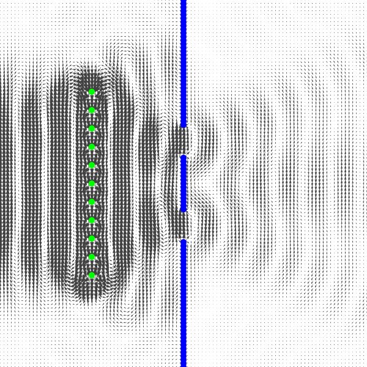

# OpenWME

OpenWME is a **general-purpose** electromagnetic field solver (EM solver), i.e., software for simulating the physics of electromagnetic fields, based on Weber-Maxwell electrodynamics. OpenWME is typically orders of magnitude faster than numerical EM solvers while providing more accurate results with fewer numerical errors. The advantages result from the fact that in Weber-Maxwell electrodynamics it is not necessary to solve Maxwell’s equations numerically.



A key element of Weber-Maxwell electrodynamics is an algebraic force formula that describes the electromagnetic force between two point charges and satisfies Newton’s third law, i.e., *actio* = *reactio*. Unlike the well-known Coulomb force, the Weber-Maxwell force can also be applied to moving and arbitrarily accelerated point charges. Thus, compared with the Coulomb force, it includes all electromagnetic effects, e.g., magnetism and induction. Weber-Maxwell electrodynamics is also well suited for modeling and analyzing electromagnetic waves. In this respect, it goes beyond the limits of Weber electrodynamics, which is included as a subset. The relation to Maxwell electrodynamics is that the Weber-Maxwell force represents the general solution of Maxwell’s equations for point charges, provided that one interprets Maxwell’s equations in an adequate way. Another important feature for engineering is that this electrodynamics fulfills the Galilean principle of relativity while at the same time ensuring that electromagnetic waves propagate at the speed of light for every receiver and observer. The Lorentz transformation is not required.

The solver was developed to support the peer review of scientific articles and to demonstrate that Weber-Maxwell electrodynamics provides correct predictions.

#### The theoretical foundations are described in several articles:
- Electrodynamics for Nonrelativistic Point Charges in Electrical Engineering: A framework based on Maxwell’s equations and Ampère’s original force law, *IEEE Antennas and Propagation Magazine*, 2025, DOI: [10.1109/MAP.2025.3555924](https://doi.org/10.1109/MAP.2025.3555924)
- Weber–Maxwell electrodynamics: classical electromagnetism in its most compact and pure form, *Electromagnetics*, 2024, DOI: [10.1080/02726343.2024.2375328](https://doi.org/10.1080/02726343.2024.2375328)
- The Importance of Weber–Maxwell Electrodynamics in Electrical Engineering, *IEEE Transactions on Antennas and Propagation*, 2023, DOI: [10.1109/TAP.2023.3278078](https://doi.org/10.1109/TAP.2023.3278078)
- Inhomogeneous wave equation, Liénard-Wiechert potentials, and Hertzian dipoles in Weber electrodynamics, *Electromagnetics*, 2023, DOI: [10.1080/02726343.2022.2161709](https://doi.org/10.1080/02726343.2022.2161709)

Preprints can be found on [Techrxiv](https://www.techrxiv.org/).

## Usage

OpenWME consists of a C++ library and a number of example applications that include the library at source code level. The examples are intentionally kept simple.

For most examples, there is also a video that demonstrates the result of the simulation.

### Quasistatics and Weber electrodynamics:
- Magnetism: [Force between two long straight wires](examples/01_quasistatics/01_magnetic_force_between_wires/magnetic_force_between_wires.webm?raw=true)
- Electromagnetic induction: [Generation of a field near a moving conductor loop with direct current](examples/01_quasistatics/02_moving_current_loop_dc_current/moving_current_loop_dc_current.webm?raw=true)
- Lorentz force: [Moving point charge in the field of a Helmholtz coil](examples/01_quasistatics/03_point_particle_in_a_helmholtz_coil/point_particle_in_a_helmholtz_coil.webm?raw=true)

### Electromagnetic waves:
- Electromagnetic induction: [Generation of a field in the vicinity of a stationary conductor loop with alternating current](examples/01_quasistatics/04_current_loop_with_ac_current/current_loop_with_ac_current.webm?raw=true)
- Electromagnetic waves: [Field of a very fast moving electromagnetic transmitter](examples/02_electromagnetic_waves/01_moving_hertzian_dipole/moving_hertzian_dipole.webm?raw=true)
- Reflection of electromagnetic waves: [Electromagnetic pulse reflected back and forth between two Hertzian dipoles](examples/02_electromagnetic_waves/02_reflection_two_resting_hertzian_dipols/reflection_two_resting_hertzian_dipols.webm?raw=true)
- Interference: [Interference of an electromagnetic wave at a double slit](examples/02_electromagnetic_waves/03_interference_at_a_double_slit/interference_at_a_double_slit.webm?raw=true)
- Fields of accelerated point charges: [Field of a point charge moving on a trajectory that corresponds to a lying eight](examples/02_electromagnetic_waves/04_point_charge_on_a_non_trival_path/point_charge_on_a_non_trival_path.webm?raw=true)
- Reflection and polarization: [Hertzian dipole in front of a mirror](examples/02_electromagnetic_waves/05_hertzian_dipole_in_front_of_a_mirror/hertzian_dipole_in_front_of_a_mirror.webm?raw=true)
- Reflection at a double slit: [Interference pattern depends on the relative position of the transmitter](examples/02_electromagnetic_waves/06_interference_depending_on_the_position_relative_to_the_openings/interference_depending_on_the_position_relative_to_the_openings.webm?raw=true)
- Electromagnetic shielding: [Shielding by destructive interference](examples/02_electromagnetic_waves/07_shielding/shielding.webm?raw=true)
- Diffraction: [Diffraction on a half-plane](examples/02_electromagnetic_waves/08_diffraction_half_plane/diffraction_half_plane.webm?raw=true)
- Diffraction: [Diffraction at two shifted half planes](examples/02_electromagnetic_waves/09_diffraction_at_shifted_half_planes/diffraction_at_shifted_half_planes.webm?raw=true)
- Shielding and scattering: [Hollow sphere within a field of a transverse_wave](examples/02_electromagnetic_waves/10_hollow_sphere_within_a_field_of_a_transverse_wave/hollow_sphere_within_a_field_of_a_transverse_wave.webm?raw=true)
- Waveguides: [Transmission of a wave in a pipe](examples/02_electromagnetic_waves/11_waveguide/waveguide.webm?raw=true)
- Why do accelerating point charges radiate electromagnetic waves: [Field of a point charge that is suddenly accelerated](examples/02_electromagnetic_waves/12_suddenly_accelerated_point_charge/suddenly_accelerated_point_charge.webm?raw=true)
- Interference: [Another example for interference at a double slit](examples/02_electromagnetic_waves/13_interference_at_a_double_slit/interference_at_a_double_slit.webm?raw=true)

### Research issues outside of classical electrodynamics:
- Special relativity: [Einstein's light clock](examples/03_special_relativity/01_light_clock/light_clock.webm?raw=true)
- Relativity of simultaneity: [Each intertial frame has its own fields](examples/03_special_relativity/02_reflection_moving_transmitter_resting_receiver/reflection_moving_transmitter_resting_receiver.webm?raw=true)
- Quantum forces: [Field of the force of a Hertzian dipole on itself when it is in front of a double slit as a function of the location](examples/04_quantum_mechanics/01_quantum_forces_at_a_double_slit/quantum_forces_at_a_double_slit.png?raw=true)

For the visualization of the results, [Cairo](https://www.cairographics.org/) is currently used. However, the library can also be used without graphical elements.

## Building from source

Development is done on Linux, typically [Ubuntu](https://ubuntu.com/) or [Debian](https://packages.debian.org/), using [GNU Make](https://www.gnu.org/software/make/) to compile the applications. To build OpenWME, the packages `build-essential` and `libcairo2-dev` are required.

## Licensing

OpenWME is free and open-source software. The source code is available under the GPL v3 license.

## Explanations regarding the examples

### 01_quasistatics/01_magnetic_force_between_wires

[main.cpp](examples/01_quasistatics/01_magnetic_force_between_wires/main.cpp) 

[video](examples/01_quasistatics/01_magnetic_force_between_wires/magnetic_force_between_wires.webm?raw=true)

The Weber-Maxwell force is a comparatively simple formula that returns only the direction and magnitude of the electromagnetic force between two point charges. The definition of electric and magnetic fields is bypassed in Weber-Maxwell electrodynamics.

However, this does not mean that magnetic forces do not exist in Weber-Maxwell electrodynamics. This example demonstrates that by considering two wires through which a direct current flows. As can be seen, the wires attract each other when the currents flow in the same direction and repel each other when the currents flow in opposite directions. In standard electrodynamics, this force is calculated using the Biot–Savart law and the Lorentz force. In Weber-Maxwell electrodynamics, by contrast, the Weber-Maxwell force between each segment of one wire and every segment of the other wire is computed and summed up. The results are practically identical.

For conductor loops with complex shapes, applying the Weber-Maxwell force is advantageous. Furthermore, the Weber-Maxwell force can also be applied to current elements within the same wire — something that is not possible with the Biot–Savart law.

The example illustrates the correct use of a DC current element. It consists of two point charges of opposite sign that are always located at exactly the same place but do not completely neutralize each other, because they have different velocities. It should be noted that a DC current element is only a model concept applicable when direct current flows in closed current loops. The example also shows how current can be switched on and off and how mechanical, non-electrical forces can be included in a simulation.

### 01_quasistatics/02_moving_current_loop_dc_current

[main.cpp](examples/01_quasistatics/02_moving_current_loop_dc_current/main.cpp) 

[video](examples/01_quasistatics/02_moving_current_loop_dc_current/moving_current_loop_dc_current.webm?raw=true)

This example illustrates electromagnetic induction. For this purpose, the field of a conductor loop carrying direct current is calculated while the loop is moved with respect to a stationary field of probes. A probe here is a special point charge that can only receive forces but cannot exert any. It is clear that such objects do not exist in reality, because every real measurement modifies the field being investigated.

A probe plays an important role in OpenWME, as it is intended to provide an overview of how a force depends on location and time. To represent a field, one must create a grid of probes in the simulation. These probes then measure the force at their respective positions. Plotting the forces of all probes at their corresponding locations produces what is called a field in standard electrodynamics. In the context of Weber-Maxwell electrodynamics, however, one should be aware that the electromagnetic force always acts only between exactly two point charges. In other words, it is a field-less electrodynamics.

Incidentally, the principle of relativity applies in an especially strict sense within Weber-Maxwell electrodynamics. This becomes evident in this example, because one could just as well keep the conductor loop at rest and move the probes instead. The force acting on the probes would then be identical.

### 01_quasistatics/03_point_particle_in_a_helmholtz_coil

[main.cpp](examples/01_quasistatics/03_point_particle_in_a_helmholtz_coil/main.cpp) 

[video](examples/01_quasistatics/03_point_particle_in_a_helmholtz_coil/point_particle_in_a_helmholtz_coil.webm?raw=true)

This example illustrates the Lorentz force by calculating how a single negatively charged point charge (an electron) moves inside a Helmholtz coil. The charge, mass, initial velocity, and position of the point charge can easily be adjusted in the source code (lines 56 and 57), resulting in completely different and sometimes quite interesting trajectories.

As already mentioned, the Weber-Maxwell force is a comparatively simple formula that does not require E and B fields. Nevertheless, this example shows that all magnetic effects are correctly included and that it is not necessary to define or use B fields explicitly.

### 01_quasistatics/04_current_loop_with_ac_current

[main.cpp](examples/01_quasistatics/04_current_loop_with_ac_current/main.cpp) 

[video](examples/01_quasistatics/04_current_loop_with_ac_current/current_loop_with_ac_current.webm?raw=true)

Electromagnetic induction occurs not only when DC current loops are moving but also when the current strength or direction changes in a stationary conductor loop. This is illustrated in this example. The drawing area represents one square meter. Due to the high frequency of 500 MHz, the wavelength is so short that individual wave trains can be distinguished. When the frequency is reduced, one can only observe how the direction of the generated field cyclically reverses. Incidentally, there is a phase shift between the change in current direction and the generated field. When the current polarity is reversed, the current has to work against the field it has previously generated itself — a kind of electromagnetic inertia. This effect is known as self‑inductance.

### 01_quasistatics/05_definition_unit_ampere

[main.cpp](examples/01_quasistatics/05_definition_unit_ampere/main.cpp) 

In this example, the force between two long, straight wires separated by a distance of one meter is calculated when a direct current of 1 A flows through each wire. According to an earlier definition of the ampere, the force should be exactly 2 × 10⁻⁷ N per meter of wire length. The program shows that this is indeed the case.

### 02_electromagnetic_waves/01_moving_hertzian_dipole

[main.cpp](examples/02_electromagnetic_waves/01_moving_hertzian_dipole/main.cpp)

[video](examples/02_electromagnetic_waves/01_moving_hertzian_dipole/moving_hertzian_dipole.webm?raw=true)

This example shows the field of a Hertzian dipole moving relative to a stationary array of probes at a very high speed (70 % of the speed of light). Due to this high velocity, a pronounced Doppler effect can be observed. In front of the Hertzian dipole, the wavelength is shortened. Since the wave for the stationary probes propagates exactly at the speed of light, this corresponds to a frequency increase — a blue shift. Behind the dipole, one can observe a red shift.

It is very interesting to analyze how the field changes if the probes are also allowed to move at 70 % of the speed of light. To do this, one simply replaces the velocity 
```
TVector(0, 0, 0)
```
on line 56 with 
```
TVector(0.7 * c, 0, 0)
```
This ensures that all probes move together with the Hertzian dipole. The result can be seen in this [video](examples/02_electromagnetic_waves/01_moving_hertzian_dipole/moving_hertzian_dipole_2.webm?raw=true).

As can be observed, co‑moving probes perceive the field in a completely different way. In particular, the Doppler effect is now absent, and the field corresponds to that of an ordinary stationary Hertzian dipole. It is also noteworthy that co‑moving probes always perceive the wave as propagating at the speed of light. This is evident from the fact that the wave fronts are circular even in this case.

Note also that Weber‑Maxwell electrodynamics does not employ a Lorentz transformation. Moreover, it should be emphasized that such relativistic effects are of no practical relevance in electrical engineering, since velocity differences occurring there are generally extremely small.

### 02_electromagnetic_waves/02_reflection_two_resting_hertzian_dipols

[main.cpp](examples/02_electromagnetic_waves/02_reflection_two_resting_hertzian_dipols/main.cpp)

[video](examples/02_electromagnetic_waves/02_reflection_two_resting_hertzian_dipols/reflection_two_resting_hertzian_dipols.webm?raw=true)

With the help of the Weber‑Maxwell force, the reflection of an electromagnetic wave at a Hertzian dipole can be represented in a comparatively simple way. There are several ways to achieve this.

The direct method consists of modeling the reflecting Hertzian dipole explicitly with two point charges and a harmonic force. The advantage of this method is that it is very close to physical reality, since an atom consists of an electron shell and an atomic nucleus. Both can move slightly relative to each other, and a harmonic restoring force may be assumed for small displacements. The disadvantage of this approach is that one must solve the equation of motion. This can only be done approximately, and over time numerical errors arise that distort the total energy.

In this simulation, therefore, a heuristic approach is used that requires almost no additional computational resources and is inherently stable. Its disadvantage is that it is somewhat less realistic and may cause phase errors. With OpenWME, both methods can be implemented.

### 02_electromagnetic_waves/03_interference_at_a_double_slit

[main.cpp](examples/02_electromagnetic_waves/03_interference_at_a_double_slit/main.cpp)

[video](examples/02_electromagnetic_waves/03_interference_at_a_double_slit/interference_at_a_double_slit.webm?raw=true)

This example is an extension of the previous example. It shows an arrangement of several reflecting Hertzian dipoles to a double slit. The primary wave is shown in black. The reflected wave, on the other hand, is displayed in red and amplified 10 times. Since the double slit consists of only a single layer of atoms, it may seem that the wave becomes stronger at the locations of the reflecting atoms. However, this is not always true, because secondary wave and primary wave superimpose and cancel each other partially behind the double slit. A similar effect happens in front of the double slit. If there were more than one atomic layer, there would be further reflections. Furthermore, the atoms of the double slit interact also with each other. This effect has been neglected in this simulation.

### 02_electromagnetic_waves/04_point_charge_on_a_non_trival_path

[main.cpp](examples/02_electromagnetic_waves/04_point_charge_on_a_non_trival_path/main.cpp)

[video](examples/02_electromagnetic_waves/04_point_charge_on_a_non_trival_path/point_charge_on_a_non_trival_path.webm?raw=true)

This example illustrates that not only Hertzian dipoles but also accelerated point charges can emit electromagnetic waves. Specifically, it shows an electron moving along a trajectory resembling a horizontal figure eight. This shape was chosen arbitrarily to demonstrate that the trajectories in OpenWME can be freely defined, provided they remain physically reasonable. The trajectory can be specified in lines 40, 46, and 52.

It is also interesting, for example, to define the field of a point charge that is suddenly and strongly decelerated. Likewise, one can experiment by reducing the parameter `freq`. This demonstrates how the wavelength increases and the wave eventually disappears, as the wave trains become so long that they no longer fit within the drawing area. The field then appears as an ordinary Coulomb field.

### 02_electromagnetic_waves/05_hertzian_dipole_in_front_of_a_mirror

[main.cpp](examples/02_electromagnetic_waves/05_hertzian_dipole_in_front_of_a_mirror/main.cpp)

[video](examples/02_electromagnetic_waves/05_hertzian_dipole_in_front_of_a_mirror/hertzian_dipole_in_front_of_a_mirror.webm?raw=true)

This example examines how the reflected wave depends on the polarization direction of the transmitter. The reflective surface is located along the right-hand edge of the image.

### 02_electromagnetic_waves/06_interference_depending_on_the_position_relative_to_the_openings

[main.cpp](examples/02_electromagnetic_waves/06_interference_depending_on_the_position_relative_to_the_openings/main.cpp)

[video](examples/02_electromagnetic_waves/06_interference_depending_on_the_position_relative_to_the_openings/interference_depending_on_the_position_relative_to_the_openings.webm?raw=true)

If a Hertzian dipole is located in front of a double slit, the field strength of the reflected wave at the position of the dipole depends strongly on its relative position to the openings. The resulting ponderomotive forces of the Hertzian dipole on itself are therefore position dependent and cause the dipole to drift gradually to specific locations. These locations form an interference pattern.

### 02_electromagnetic_waves/07_shielding

[main.cpp](examples/02_electromagnetic_waves/07_shielding/main.cpp)

[video](examples/02_electromagnetic_waves/07_shielding/shielding.webm?raw=true)

In this example, the reflection parameters are chosen such that an incident wave is almost completely canceled on the opposite side of an obstacle. This effect is caused by destructive interference.

### 02_electromagnetic_waves/08_diffraction_half_plane

[main.cpp](examples/02_electromagnetic_waves/08_diffraction_half_plane/main.cpp)

[video](examples/02_electromagnetic_waves/08_diffraction_half_plane/diffraction_half_plane.webm?raw=true)

A simple example of diffraction at a half plane.

### 02_electromagnetic_waves/09_diffraction_at_shifted_half_planes

[main.cpp](examples/02_electromagnetic_waves/09_diffraction_at_shifted_half_planes/main.cpp)

[video](examples/02_electromagnetic_waves/09_diffraction_at_shifted_half_planes/diffraction_at_shifted_half_planes.webm?raw=true)

Diffraction can also occur multiple times. This example shows two half-planes arranged so that the point source of the EM field is not directly visible along a straight line behind them. Nevertheless, a small portion of the EM wave can still pass both half-planes. Particularly striking is that the source behind the half-planes appears to be located elsewhere, creating the illusion of a curved propagation of the EM field. This effect is known as the shadow blister effect (see, for example, https://www.ej-physics.org/index.php/ejphysics/article/view/304).

### 02_electromagnetic_waves/10_hollow_sphere_within_a_field_of_a_transverse_wave

[main.cpp](examples/02_electromagnetic_waves/10_hollow_sphere_within_a_field_of_a_transverse_wave/main.cpp)

[video](examples/02_electromagnetic_waves/10_hollow_sphere_within_a_field_of_a_transverse_wave/hollow_sphere_within_a_field_of_a_transverse_wave.webm?raw=true)

In this example, the Weber-Maxwell force is used to calculate how a closed metallic surface suppresses the penetration of an electromagnetic field (for reasons of convenience, only a metallic ring is simulated). In principle, however, there are no limits, and arbitrary surfaces and shapes can be analyzed.

### 02_electromagnetic_waves/11_waveguide

[main.cpp](examples/02_electromagnetic_waves/11_waveguide/main.cpp)

[video](examples/02_electromagnetic_waves/11_waveguide/waveguide.webm?raw=true)

The example shows that electromagnetic waves can be guided inside of a metal tube (https://en.wikipedia.org/wiki/Waveguide).

### 02_electromagnetic_waves/12_suddenly_accelerated_point_charge

[main.cpp](examples/02_electromagnetic_waves/12_suddenly_accelerated_point_charge/main.cpp)

[video](examples/02_electromagnetic_waves/12_suddenly_accelerated_point_charge/suddenly_accelerated_point_charge.webm?raw=true)

A stationary point charge generates a Coulomb field with radial field lines. When the charge is suddenly accelerated, this no longer holds, and a wave train is emitted that propagates at the speed of light. In this example, an initially stationary charge is accelerated to 50% of the speed of light and then continues with uniform motion. The field then appears compressed in the direction of motion. The Weber-Maxwell force encompasses all these special cases within a single equation.

### 02_electromagnetic_waves/13_interference_at_a_double_slit

This example provides another demonstration of interference at a double slit. Here, however, an almost completely reflective surface is used. In addition, the wave is not split into two components.

[main.cpp](examples/02_electromagnetic_waves/13_interference_at_a_double_slit/main.cpp)

[video](examples/02_electromagnetic_waves/13_interference_at_a_double_slit/interference_at_a_double_slit.webm?raw=true)

### 02_electromagnetic_waves/14_pizzellas_experiment

This simulation examines why the electric field of a point charge accelerated to nearly the speed of light appears instantaneously in the plane directly at the exit of a metallic pipe (R. de Sangro et al., "Measuring propagation speed of Coulomb fields", *Eur. Phys. J. C* 75, 2015). At first glance, this seems to violate the principle that fields cannot propagate faster than light. The reason is that at high speeds, metallic shielding becomes largely ineffective. The Coulomb field of a fast-moving point charge is strongly compressed in the direction of motion but intensified transversely. Consequently, the shield can no longer compensate the field quickly enough and becomes increasingly transparent.

[main.cpp](examples/02_electromagnetic_waves/14_pizzellas_experiment/main.cpp)

[video](examples/02_electromagnetic_waves/14_pizzellas_experiment/pizzella_experiment.webm?raw=true)

### 02_electromagnetic_waves/15_edge_and_synchrotron_radiation

Field of a particle that is forced to change its direction of motion.

[main.cpp](examples/02_electromagnetic_waves/15_edge_and_synchrotron_radiation/main.cpp)

[video](examples/02_electromagnetic_waves/15_edge_and_synchrotron_radiation/edge_and_synchrotron_radiation.webm?raw=true)

### 02_electromagnetic_waves/16_cyclotron

Field of a particle that is accelerated in a cyclotron.

[main.cpp](examples/02_electromagnetic_waves/16_cyclotron/main.cpp)

[video](examples/02_electromagnetic_waves/16_cyclotron/cyclotron.webm?raw=true)

### 03_special_relativity/01_light_clock

[main.cpp](examples/03_special_relativity/01_light_clock/main.cpp)

[video](examples/03_special_relativity/01_light_clock/light_clock.webm?raw=true)

The light clock model is often used in special relativity to demonstrate that time passes more slowly in moving inertial frames. The basic principle is that light, traveling at the speed of light in every inertial frame, must cover a longer distance in a moving light clock than in a stationary one.

Weber-Maxwell electrodynamics was developed for electrical engineering and does not claim to make accurate predictions at velocities near the speed of light. Nevertheless, it is interesting to examine the results obtained in this case. The [video](examples/03_special_relativity/01_light_clock/light_clock.webm?raw=true) shows a transmitter (green) emitting a light pulse at time 0 ns. The circular shape of the wave confirms that this pulse travels at the speed of light relative to the stationary grid of probes.

Intuitively, one might expect the light pulse to be reflected by the reflector (blue) only when the primary wave (black) reaches it. However, the video shows the reflector emitting a secondary pulse (red) already at 1 ns. This appears to be an error, but it is not: the field as seen by stationary probes differs from the field as seen by probes co-moving with the transmitter and reflector.

This co-moving field can also be displayed. Simply replace `TVector(0, 0, 0)` with `TVector(1, 0, 0)` in lines 68 and 88 of [main.cpp](examples/03_special_relativity/01_light_clock/main.cpp). The result is shown in this [video](examples/03_special_relativity/01_light_clock/light_clock_2.webm?raw=true). As can be seen, the wave still propagates at the speed of light relative to the co-moving probes. Moreover, a uniformly moving clock cannot determine whether it is moving or at rest.

A consequence of this analysis is that Weber-Maxwell electrodynamics satisfies Einstein's postulates in a particularly strict form, yet exhibits neither relativistic time dilation nor Lorentz contraction.

### 03_special_relativity/02_reflection_moving_transmitter_resting_receiver

[main.cpp](examples/03_special_relativity/02_reflection_moving_transmitter_resting_receiver/main.cpp)

[video](examples/03_special_relativity/02_reflection_moving_transmitter_resting_receiver/reflection_moving_transmitter_resting_receiver.webm?raw=true)

This example provides a more detailed analysis of the light clock scenario. Here, only the transmitter is moving, while the reflector and probes remain stationary. Consequently, the arrival of the primary wave and emission of the secondary wave appear synchronous for the first reflection. This is not the case for the second reflection. This behavior is correct and follows the same reasoning as in the previous example.

### 04_quantum_mechanics/01_quantum_forces_at_a_double_slit

[main.cpp](examples/04_quantum_mechanics/01_quantum_forces_at_a_double_slit/main.cpp)

[image](examples/04_quantum_mechanics/01_quantum_forces_at_a_double_slit/quantum_forces_at_a_double_slit.png?raw=true)

This example significantly exceeds the typical scope of electrical engineering. It represents an interesting byproduct that emerged during the development of Weber-Maxwell electrodynamics. Specifically, it was observed that electromagnetic transmitters exert self-forces when near matter, which reflects the emitted waves back toward the transmitter. Depending on the shape and arrangement of the surrounding matter, these self-forces exhibit interesting spatial patterns.

In this example, a single Hertzian dipole is placed in front of a double-slit aperture, and the reflection from the double slit is calculated (see also this [video](examples/02_electromagnetic_waves/06_interference_depending_on_the_position_relative_to_the_openings/interference_depending_on_the_position_relative_to_the_openings.webm?raw=true)). The reflected forces are then time-averaged, and the dipole's position is systematically varied in a raster pattern. The resulting [image](examples/04_quantum_mechanics/01_quantum_forces_at_a_double_slit/quantum_forces_at_a_double_slit.png?raw=true) shows the electromagnetic self-force field that a single Hertzian dipole exerts on itself as a function of its position in front of the double slit.

As can be seen, the force is not zero, and it becomes clear that a transmitter avoids certain positions while preferring others depending on its transmission frequency. If the reflector (blue) were infinitely extended and without openings, all positions along the z-axis would be equivalent, though the transmitter would still prefer discrete distances from the reflecting surface based on frequency.

The addition of openings introduces discretization even along the z-axis. It is reasonable to hypothesize that such classical forces might underlie quantum effects. For further reading, see: [On the wave-particle duality of a Hertzian dipole, *Annales de la Fondation Louis de Broglie*, Volume 49, 2025](https://fondationlouisdebroglie.org/AFLB-491/1007Kuehn.pdf)

### 04_quantum_mechanics/02_single_particle_interference

This example demonstrates the calculation of the ponderomotive field created by reflection of a single Hertzian dipole's electromagnetic wave at an atomic barrier. It also shows how strongly the trajectory of a Hertzian dipole in such a field depends on its initial position and the barrier's shape. Averaging the trajectories obtained by varying the starting position produces distribution patterns familiar from real experiments with electrons or photons.

**Single-slit trajectories:** [video](examples/04_quantum_mechanics/02_single_particle_interference/interference.webm?raw=true)

**Double-slit trajectories:** [video](examples/04_quantum_mechanics/02_single_particle_interference/interference.webm?raw=true)

These simulations are part of the preprint: [Induced ponderomotive fields: A classical approach to single-electron interference, the uncertainty principle, and the quantum measurement problem](https://doi.org/10.36227/techrxiv.176948933.35562758/v1).


